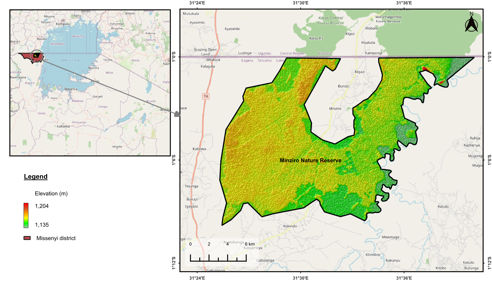

# Minziro Nature Forest Reserve

> Location: -1.10961,31.48429
> Missenyi, Kagera, Tanzania.

Minziro Nature Forest Reserve(MNFR) covering an area of 25717 ha is located in misenyi district Kagera Region in North-Western Tanzania. The forest is an eastern extension of the Guinea-Congo biome which is home to diverse and unique flora and fauna. The uniqueness of its biological richness makes this forest an important protected area. Plants such as _Afrocarpus dawei_ are endemic to MNFR while the endangered wild coffee is found in several patches in this forest. The rare Thomas's galago and grey-cheeked mangabey are not found anywhere else in Tanzania. Minziro being a forest located in the Northwest means it is home to species of birds which are restricted to the west. Out of 245 bird species recorded in this forest, 58 are not found outside the Kagera Region of Tanzania.

The map below shows the location of this reserve (credit: Anordius George).
More information on access and/or transportation to the site can be accessed through this [link](https://www.orniverse.com/site/3712/minziro-forest-reserve-i-tanzania-i).

